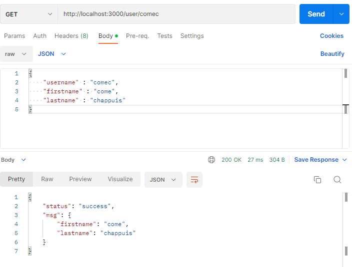

# 
# DevOps - Côme CHAPPUIS

Here is my DevOps project presentation.
The README will help you to understand the project, with examples and pictures


### 1. Create a web application

This first part is about making a user API using express. You can find my test with POSTMAN.

To start the API, first install redis server on your computer, then run : 
```
redis-server
cd userapi
npm run start
```

You can use POSTMAN to send GET or POST requests :

Case #1: POST user


Case #2: GET user




To run tests using mocha.js, run the following :
```
npm run test
```
### 2. Apply CI/CD pipeline

You can find the script of the workflow under the `.github/workflows` folder of the repository.

Here is a screenshot of the worflow working well in github:


### 3. Configure and provision a virtual environment and run your application using the IaC approach

To do so, go to the `iac` folder and run :
```
vagrant up
```
### 4. Build Docker image of your application
I have the image application pushed on Docker HUB
To reproduce it : 
```
cd userapi/
docker tag comechappuis/devopschappuis <DOCKER_ACCOUNT_NAME>/<CUSTOM_IMAGE_NAME>
docker push <DOCKER_ACCOUNT_NAME>/<CUSTOM_IMAGE_NAME>
```


### 5. Make container orchestration using Docker Compose
The `docker-compose.yml` will first create a redis container, and the our app container to run it.
```
cd userapi/
docker-compose up
```
### 6. Make docker orchestration using Kubernetes

We need to initialize in a fist time minikube, in order to run kubernetes on our computer
```
cd k8s
minikube start --driver=docker
kubectl apply -f .
```


### 7. Make a service mesh using Istio


### 8. Implement Monitoring to your containerized application


### Author
Côme CHAPPUIS

